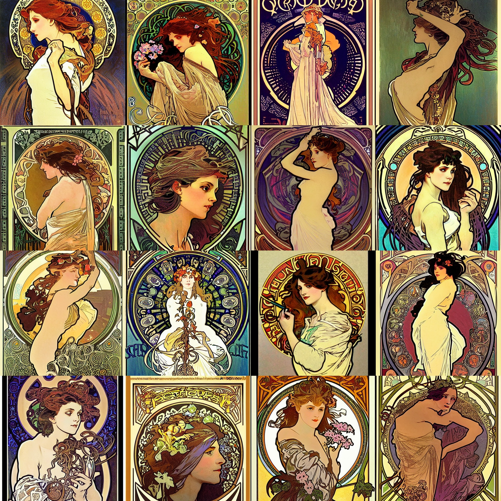
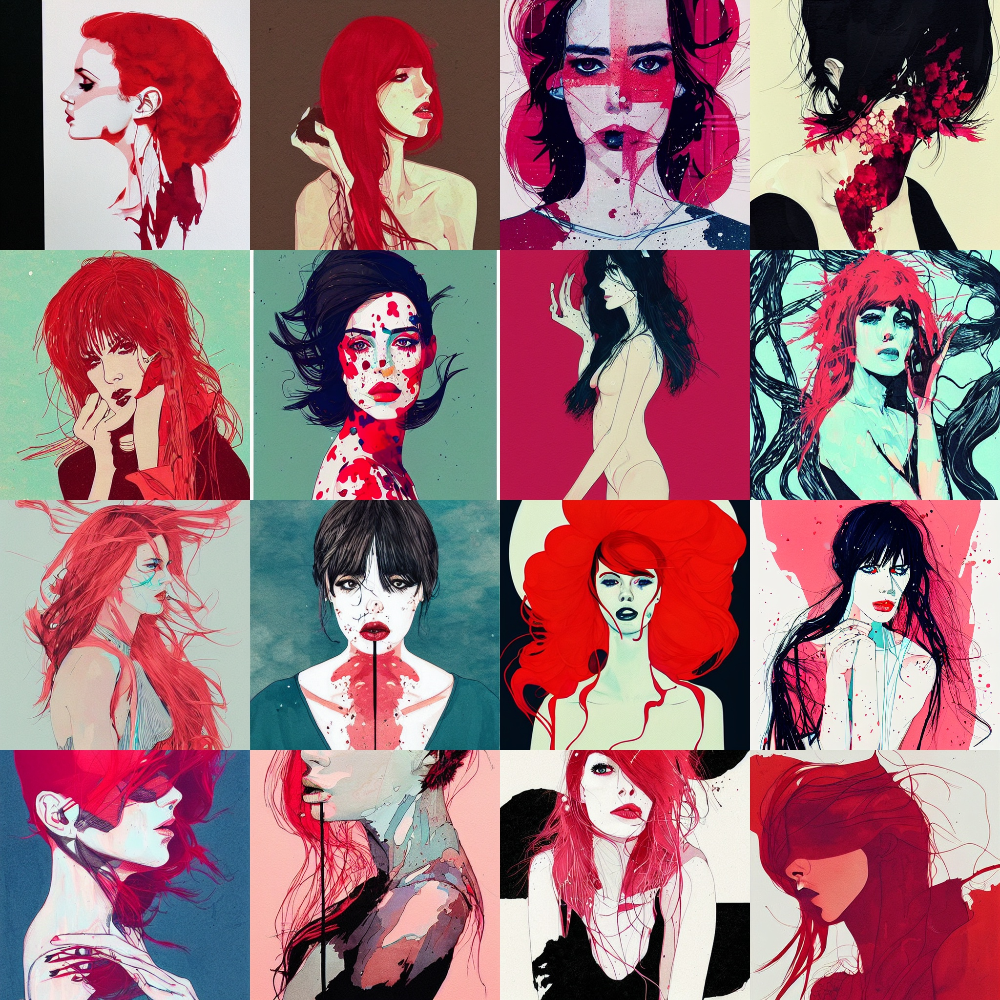
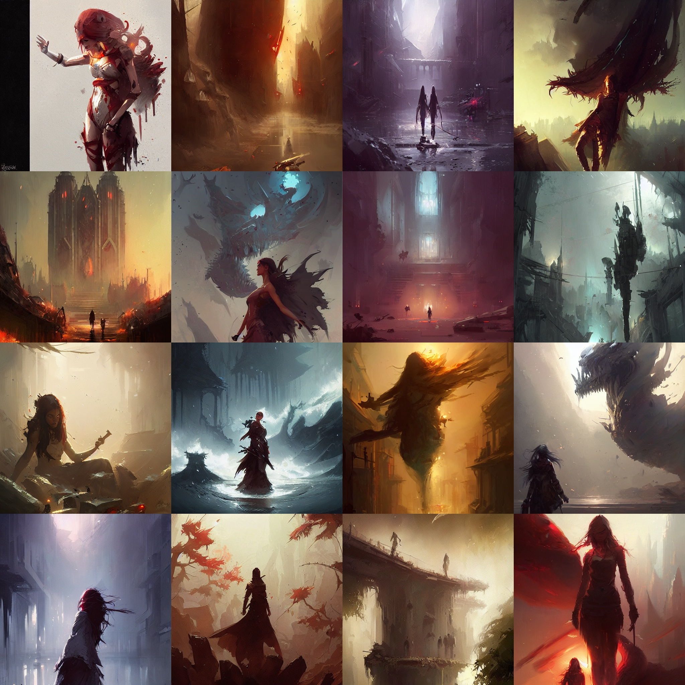
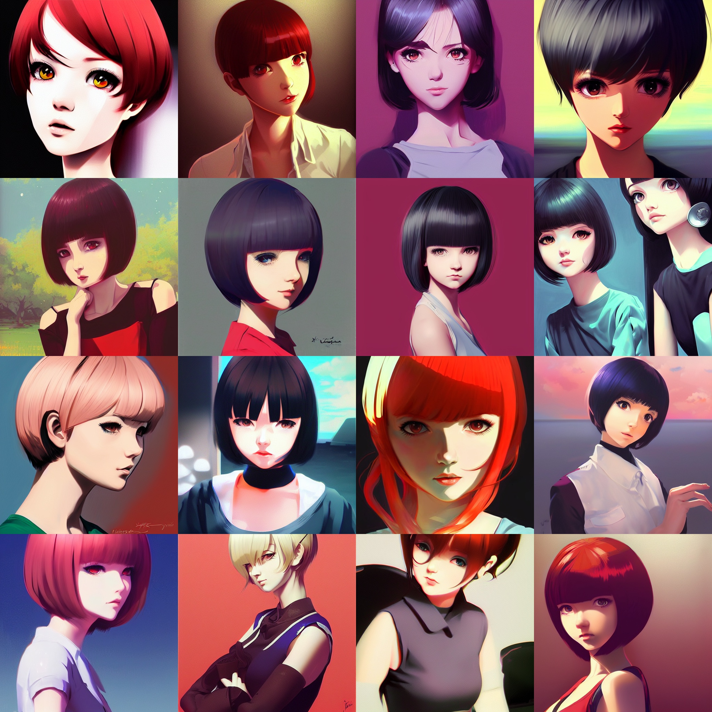
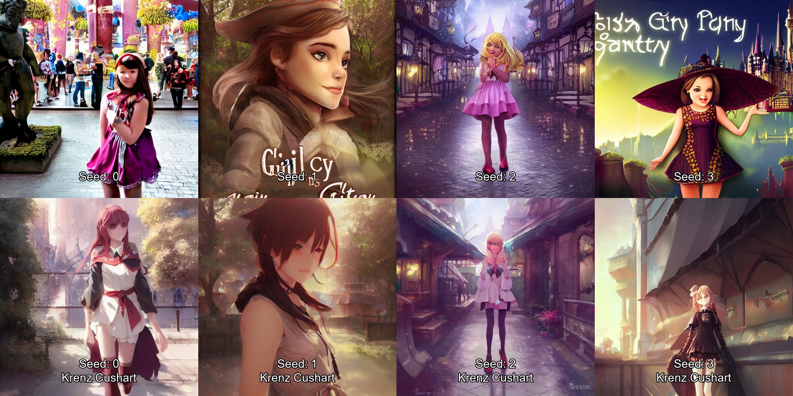
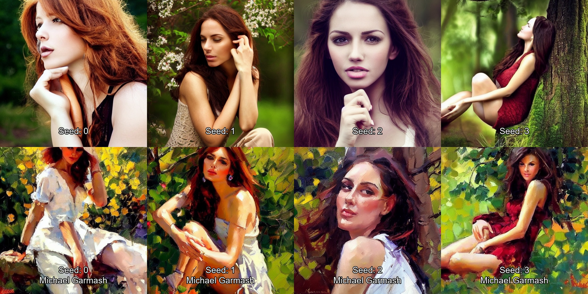

# Description

This repo contains a list of artists whose names can be added to Stable Diffusion prompts to change the art style. Images are provided to give a rough idea of how Stable Diffusion interprets their style.

All images are generated with model 1.4 and the following parameters:

Prompt: \<artist name> art
Seed: 0
Size: 512x512
CSG: 7.5
Sampling Steps: 30

# Contributing

If there is an artist that the model knows about that you think should be on this list, you can open an issue or pull request. Keep in mind that Stable Diffusion does not know every single artist.

# Artists

### 

Akihiko Yoshida

### 

Alphonse Mucha

### 

Artgerm (NSFW)

### 

Conrad Roset

### 

Greg Rutkowski

### 

Ilya Kuvshinov

### 

Krenz Cushart

### 

Michael Garmash

