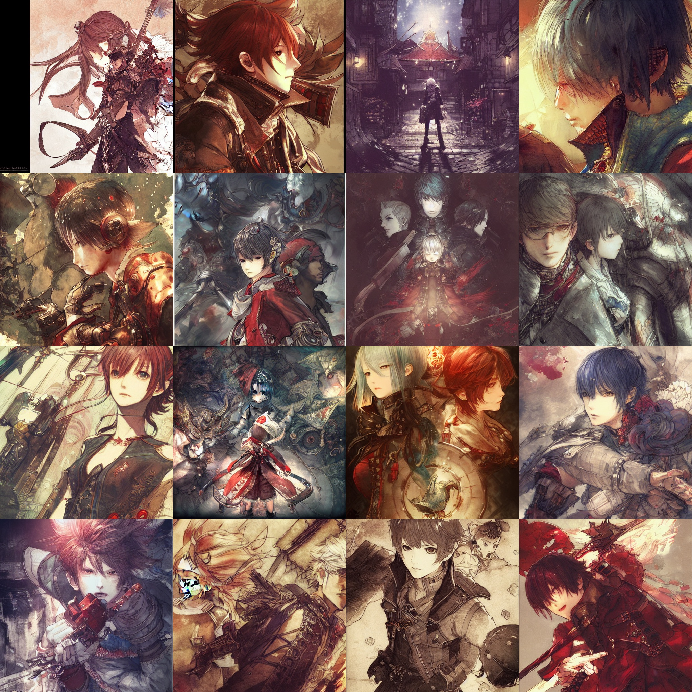
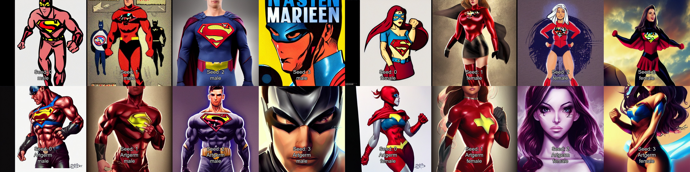

# Description

This repo contains a list of artists whose names can be added to Stable Diffusion prompts to change the art style. Images are provided to give a rough idea of how Stable Diffusion interprets their style.

All images are generated with model 1.4 and the following parameters:

Prompt: \<artist name> art
Seed: 0
Size: 512x512
CSG: 7.5
Sampling Steps: 30

# Contributing

If there is an artist that the model knows about that you think should be on this list, you can open a pull request to add them.

All types of artists are welcome. A prompt matrix image like the ones below should be provided. The prompt should reflect the artist's primary subjects. Make sure you use the generation parameters listed above.

# Artists

## Akihiko Yoshida

## Alphonse Mucha

## Artgerm
>

## Conrad Roset

## Greg Rutkowski

## Ilya Kuvshinov

## Krenz Cushart

## Michael Garmash

